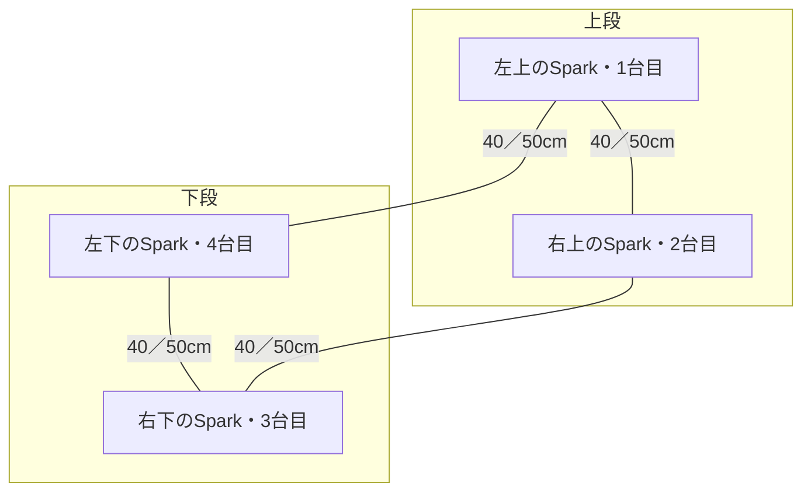

# 4台専用ラックは2列×2段と中央のスイッチ置き場で設計する

DGX Sparkが4台になったため、最初から4台を支える共通フレームへ設計を改めます。配置は2列×2段とし、将来のスイッチはラック内の交換可能な置き場に載せます。当初は両接続とも50cmの指定でしたが、その後に**QSFP112ダイレクトアタッチケーブル40cmを4本所有している**ことが分かりました。手持ち40cmと当初の50cmを比較します。

2026年10月9日のユーザー指定を記録した設計条件です。[調整できる仮配置と参照モデル](仮配置の確認.md)を作成しました。ラック外形や印刷部品の寸法はまだ確定していません。連結式の従来設計は[保全パッケージ](../../../archive/spark-rack-modular-20261009/README.md)に残しました。

## 基本方針を維持し、136部品案を不採用とする

2026年10月9日に、ユーザーから「方針は問題なさそうです」と確認を受けました。4台専用の2列×2段、本体用140mmファン4個、電源用120mmファン2個、将来の交換可能なスイッチ置き場を基本案として採用します。電源は当初別置きでしたが、その後のユーザー指定で枠内への統合を検討する方針へ変わりました。同じ4台用フレーム内で支持段を移動し、リング運用とスイッチ接続に対応する方針です。

構成の方針は維持します。2026年10月9日17:21の136部品案は採用せず、[部材の凹凸と段差を持つ次案](凹凸の接合試験片と次案.md)へ進みます。下段高さと制御ケース位置は共通定義にそろえ、未測定の端子位置から梁へ取付穴を固定しません。スイッチ支持板は耳込み幅と奥行が確定してから設計します。

## 確定した条件

| 項目 | 条件 |
|---|---|
| 本体 | DGX Spark 4台、2列×2段 |
| 枠の構成 | 4台用の共通フレーム。1台用ラックを増設する連結機構は不要 |
| 当面の接続 | 4台を輪につなぐリング接続。手持ち40cm×4本と当初の50cm条件を比較 |
| 将来の接続 | MikroTik CRS812またはCRS804へ接続。当初は50cm。手持ち40cmの再利用は電気的な適合を確認する |
| スイッチの収容 | ラック内に交換可能な設置場所を用意する。機種は未確定 |
| 冷却部品の用途 | 本体用140mmファン4個を用意予定。電源用120mmファン2個は枠内統合案でも電源用へ割り当てる。既存のファンコントローラーケースの設計を利用する |
| 旧設計 | ファイルを保全し、従来版と新設計を区別する |

4台用の共通フレームでも、プリンターの造形範囲に合わせて部品を分割して組み立てられます。不要なのはラックの増設用連結機構であり、造形部品の組立接合まで一体造形に限定する指定ではありません。

## リングは隣接する4台を一周させる

次の図は背面から見た配置です。全台の背面端子を同じ側へ向け、横方向2本と縦方向2本で一周させます。図中の台番号は配線を識別するための仮番号です。



| ケーブル | 接続先 | 配線する方向 |
|---|---|---|
| 上段の横配線 | 左上と右上 | 横 |
| 右側の縦配線 | 右上と右下 | 縦 |
| 下段の横配線 | 右下と左下 | 横 |
| 左側の縦配線 | 左下と左上 | 縦 |

各台で左右2つの高速接続端子を使います。どちらの端子を隣のどの端子へつなぐかは、実機の位置とケーブルの引き出し方向を測ってから決めます。輪の閉じ方に対角配線を使わず、最長経路を抑える方針です。

ここで記録するのは物理配線の条件です。4台リングでのネットワーク設定と分散処理の動作は、ラックの形状検査とは別に確認します。

## スイッチの端子を上下段の間へ近づける

スイッチは上下段の間に置き、スイッチの接続端子面をSparkの背面端子に近い面へそろえる案を第一候補とします。上段・下段の両方から短いケーブルで届く位置を探します。置き場は交換できる支持板とし、機種による幅・奥行・端子位置の違いを調整できるようにします。

```text
背面側の配置案（寸法未確定）

  [左上のSpark]       [右上のSpark]
          ＼           ／
       [スイッチの接続端子面]
          ／           ＼
  [左下のSpark]       [右下のSpark]

各Sparkからスイッチまで40cmと50cmの条件を比較する。
リング運用時もSparkの配置は同じ。
```

スイッチ接続時は各Sparkからの4経路を個別に検査します。端子が機器の中央にあるとは仮定しません。リング用の4本をそのまま流用できるかは、コネクターの規格と選ぶスイッチの対応を確認してから判断します。

スイッチの端子面、Sparkの背面、電源の端子は抜き差しできるように開放します。スイッチの前後方向は実機の吸排気と電源の交換方向を確認して決め、短い配線のために通風や保守を塞がない配置を選びます。

## 寸法の根拠と未確定値

| 対象 | 公開資料の値 | 設計への扱い |
|---|---|---|
| DGX Spark | 幅150×奥行150×高さ50.5mm、質量1.2kg | 本体4台で4.8kg。足の接触位置と端子位置は実測が必要 |
| CRS812-8DS-2DQ-2DDQ-RM | 製品資料は443×268×44mm。公式取扱説明は443×156×44mm | 奥行の記載が不一致。仮配置では大きい268mmを使い、最終寸法は確認する |
| CRS804-4DDQ-hRM | 公式寸法図に218、360、387、44mmの寸法がある | 筐体と突出部の区別を寸法図で確認してから収容形状へ反映する |
| ケーブル | 所有40cm×4本、当初指定の50cmも比較 | 長さの測定基準、コネクター長、曲げ半径、引き出し余裕は型番または実測で確認する |

出典は[NVIDIAの本体仕様](https://docs.nvidia.com/dgx/dgx-spark/hardware.html)、[CRS812製品資料](https://cdn.mikrotik.com/web-assets/product_files/CRS812-8DS-2DQ-2DDQ-RM_251055.pdf)、[CRS812公式取扱説明](https://help.mikrotik.com/docs/spaces/UM/pages/340492410/CRS812-8DS-2DQ-2DDQ-RM)、[CRS804公式寸法図](https://cdn.mikrotik.com/web-assets/product_files/CRS804_dimensionsR0_260152.pdf)です。確認日は2026年10月9日です。

旧ラックの幅210×奥行230×高さ170mm、140mm追加ファン、外置き電源アダプターは従来設計の値です。新ラックに採用する値は、配線と通風を含む配置を比較して決めます。本体と電源のファンの用途は下記の構成で採用します。電源アダプターの実物適合と使用材料は未確定です。

## 手持ちのファンを使う取付場所を設ける

ユーザー指定は、140mmをDGX Spark用に合計4個用意し、120mmは電源アダプター用へ使う構成です。120mmの個数は既存図面にある2個を基準とします。140mmの4個は用意予定であり、全数を所有済みと確認した記録ではありません。

本体側はSpark各台へ140mmを1個ずつ割り当て、前面側に取り外せる保持部を置きます。電源側は共通枠の手前下側へ4個を2列×2段で置き、左右の120mmファン各1個から側面へ排気する構想です。電源と本体の間に参考の仕切りを置きます。既存の別置きラックも保持します。120mmをSparkへ振り替えません。吸排気方向と冷却効果は実機で確認します。

ファンを個別制御する既存方針では、本体側4組と電源側2組、合計6組のコントローラーとケースが必要です。既存ケースの設計を使い続け、必要数と所有数は区別します。

ファンを含む配置は、スイッチ、支持部、ファンコントローラーケース、ガード、配線との干渉を検査してから採用します。配置参考には140mmファン4個と制御ケース4個の参考外形を残します。保持部へ導風を加える次案は形状検討に留め、未測定の通気口へ固定しません。スイッチ接続時は上下中心間隔220mm、当面のリング運用はスイッチを外して160mmとし、同じ4台用フレーム内で支持段を移動する案です。Sparkの支持範囲は本体の奥行150mmに合わせました。取付金具、実際のケース形状と配線の操作空間、冷却効果は未検証です。

## 40cmと50cmに収まるかはケーブルの経路で判定する

端子間の直線距離が公称長より短いだけでは、ケーブルが届くことの確認にはなりません。端子から真っすぐ引き出す部分、曲げる部分、ケーブルを支える経路を含めて判定します。両端コネクターの長さをケーブルの公称長へ含むかも確認します。

寸法を決める前に、実機とケーブルの型番・端子位置・曲げ条件を記録します。その値でリング4経路とスイッチ4経路の配置模型を作り、各経路の長さ、余り、抜き差し空間を検査します。曲げ条件が不明な経路は未検証のまま扱います。

配線が収まる配置を選んでから、共通フレーム、支持部、スイッチ支持板、配線保持部を設計します。部品分割は造形範囲に合わせて決めます。本体4台に加えてスイッチ・支持板・必要な冷却部品の荷重を確認し、実物の適合・耐荷重・冷却を試作で検証します。

配置模型では、仮の端子位置と曲げ条件で配線を評価しています。[136部品案](4台ラックの部品案.md)は不採用です。部品案の下段は72mmへ上げ、接続金具と下側の外周梁の重なりを避けています。採用前に実測値を反映し、接続部分から試作します。

## 手持ち40cmのスイッチでの動作は未確認

ELSAの[40cm製品TS000111](https://www.elsa-jp.co.jp/products/detail/nvidia-dgx-spark-cable/)はSpark同士の接続用として掲載されています。手元の製品がこの型番かは未確認です。MikroTikの[対応仕様](https://help.mikrotik.com/docs/spaces/ROS/pages/220233794/MikroTik%20wired%20interface%20compatibility)はCRS812のQSFP56端子と両機種のQSFP56-DD端子で、銅線4レーンの200ギガビット毎秒接続に対応すると記載しています。手元の40cmケーブルの認識と安定動作は未確認です。

一方、ELSAの[50cm製品IN000200](https://www.elsa-jp.co.jp/products/detail/qsfp56-200g-dac-cable-50cm_h/)にはMikroTik 804/812との接続確認が明記されています。40cmの製品へその確認結果を引き継ぎません。実機の識別表示を確認してから再利用の可否を判断します。
